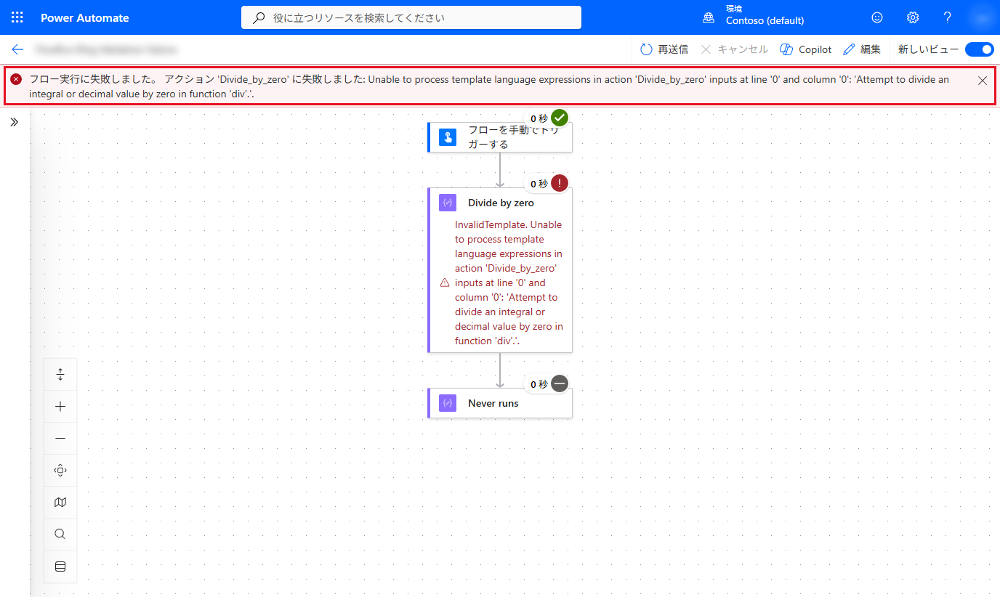
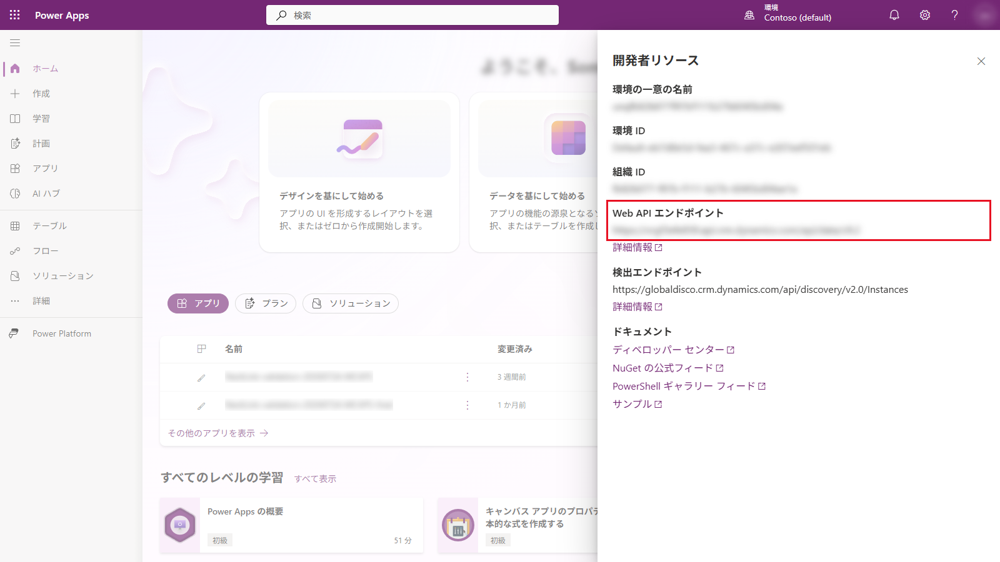
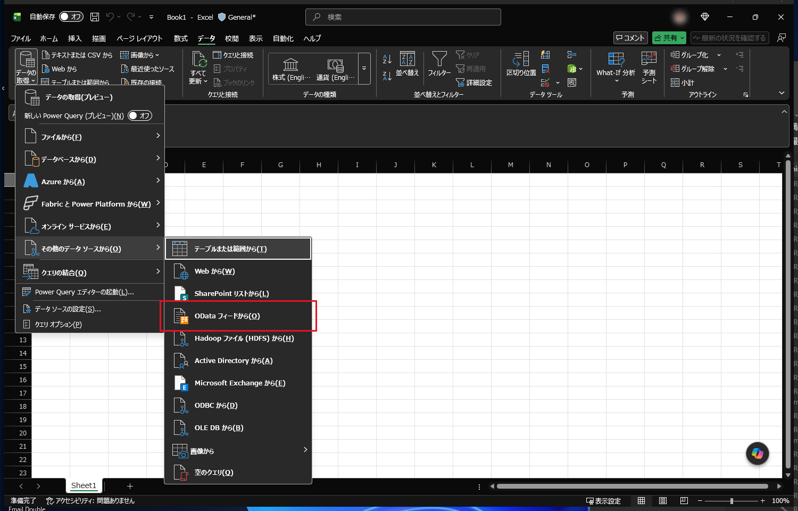
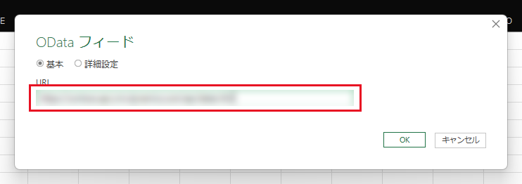
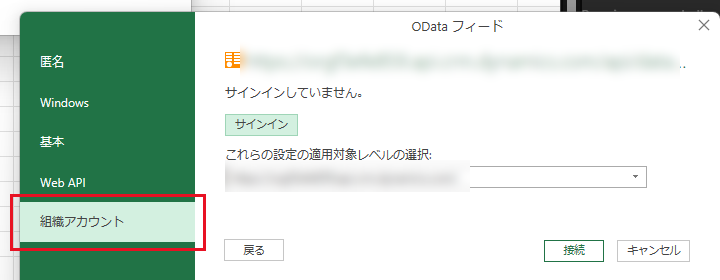
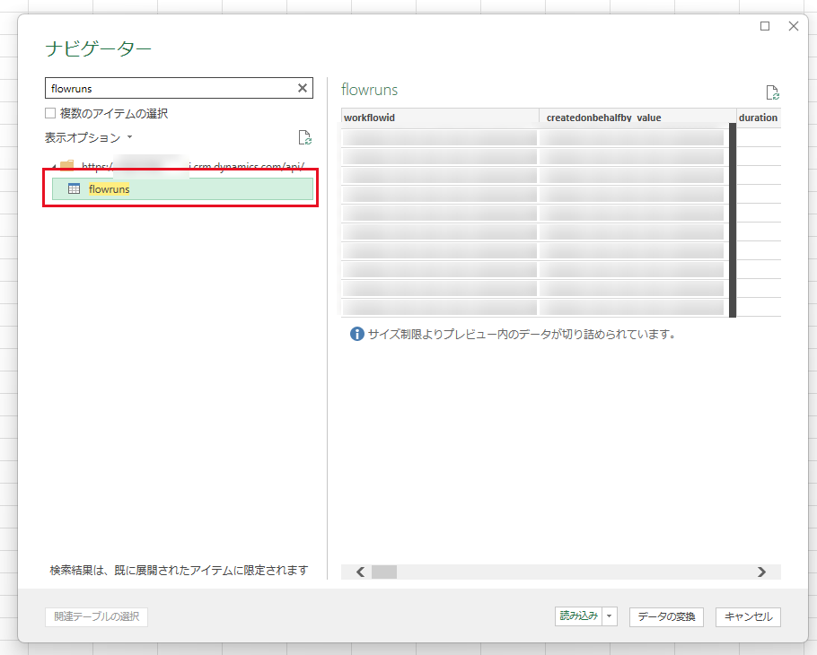
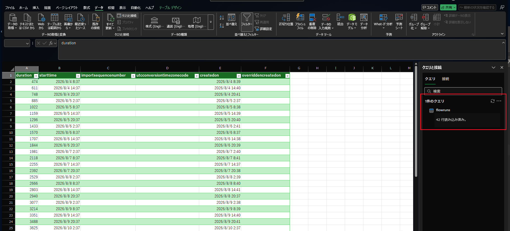
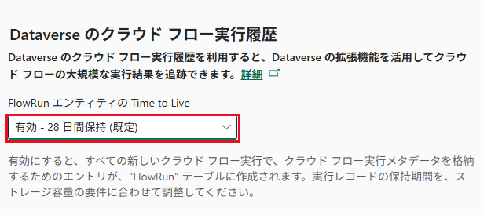
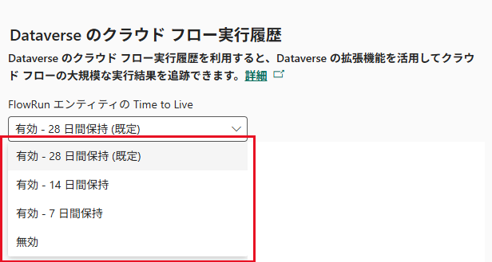

こんにちは、Power Platform サポートチームの早坂です。  
本記事では、管理者が Power Automate クラウド フローの実行履歴を確認、取得する方法についてご案内します。

Power Automate ポータル、オートメーション センター、Dataverse の `FlowRun` テーブル、Application Insights では、取得できる情報や対象となるフローが異なります。本記事では、それぞれの特徴と利用方法をご紹介します。

<!-- more -->

# 目次

1. [概要](#anchor-overview)
   1. [対象となるクラウド フロー](#anchor-prerequisites)
   1. [目的に応じた確認方法](#anchor-methods)
1. [FlowRun テーブルに保存される情報](#anchor-flowrun-data)
1. [Excel の OData フィードから取得する](#anchor-excel)
1. [Dataverse Web API から取得する](#anchor-web-api)
1. [アクション単位の詳細を確認する](#anchor-action-details)
1. [保持期間とデータの完全性](#anchor-retention)
1. [実行履歴が保存されない主な条件](#anchor-ingestion-failures)
1. [まとめ](#anchor-summary)
1. [参考情報](#anchor-references)

---

<a id='anchor-overview'></a>

# 1. 概要

<a id='anchor-prerequisites'></a>

## 1-1. 対象となるクラウド フロー

確認方法によって対象範囲が異なります。Power Automate ポータルでは、アクセス権を持つ対象フローの実行履歴を確認できます。

一方、`FlowRun` テーブルへ実行履歴が保存される対象は、定義が Dataverse に保存されているクラウド フローです。オートメーション センターのクラウド フロー実行データにも `FlowRun` が使用されます。

> [!IMPORTANT]
> 公開情報では、`FlowRun` の対象は「定義が Dataverse に保存されているソリューション クラウド フロー」と説明されています。一方、弊社の環境では、独自のソリューションへ追加していないフローについても、既定のソリューションに定義が存在し、`FlowRun` へ実行履歴が保存されることを確認しました。

弊社の環境で確認した結果は以下のとおりです。

| フローの状態 | Dataverse の `workflow` テーブル | `FlowRun` への記録 |
|---|---|---|
| 独自のソリューションに追加している | 存在する | 記録される |
| 既定のソリューションのみに含まれる | 存在する | 記録される |
| 定義が Dataverse に保存されていない | 存在しない (`404`) | 記録されない |

対象のフローの定義が Dataverse に存在するかどうかは、Web API で `workflow` テーブルを参照して確認できます。

```http
GET https://<組織 URL>/api/data/v9.2/workflows(<クラウド フロー ID>)?$select=name,category
```

弊社の環境では、フローの情報が返された場合は `FlowRun` へ実行履歴が記録され、`404` が返された場合は記録されませんでした。なお、`404` は対象のフロー定義が見つからないことを示す結果であり、すべての環境における記録可否を保証するものではありません。

本記事では、Dataverse Web API を使用してデータを読み取る例を紹介します。API の実行には、対象環境の `FlowRun` テーブルを読み取る権限と、Dataverse Web API 用のアクセストークンが必要です。システム管理者ロールなど、環境内の `FlowRun` レコードを組織単位で読み取れる権限があれば、自分が所有していないフローの実行履歴も取得できます。

> [!NOTE]
> 本記事の内容は、2026 年 8 月 26 日に検証用の Dataverse 環境とクラウド フローを使用して確認したものです。
> 画像内の環境固有の値やユーザー情報は、弊社検証環境の情報であるためマスキングしています。

<a id='anchor-methods'></a>

## 1-2. 目的に応じた確認方法

管理者が利用できる主な確認方法は以下のとおりです。

| 目的 | 使用する機能 | 対象と特徴 |
|---|---|---|
| 特定の実行を調査する | Power Automate ポータルの実行履歴 | 対象フローへのアクセス権が必要です。実行、トリガー、各アクションの状態、入力、出力、追跡 ID などを確認できます。実行履歴はトランザクション ベースです。 |
| 環境内の自動化を横断的に監視する | オートメーション センター | ダッシュボードから実行ログ、エラー、パフォーマンスなどを確認できます。クラウド フローの実行データには `FlowRun` が使用されます。 |
| コードを書かずに一覧を取得・集計する | Excel の OData フィード | Dataverse Web API へ接続し、`FlowRun` の内容を Excel のテーブルとして取得できます。定期的な集計やレポート作成に適しています。 |
| 実行結果を API で取得・自動処理する | Dataverse Web API / PowerShell | 定義が Dataverse に保存されているクラウド フローが対象です。実行単位の状態、開始・終了時刻、実行時間、エラー概要などを取得できます。アクション単位の詳細は含まれません。 |
| アクション単位で継続的に監視・分析する | Application Insights | クラウド フローの実行、トリガー、アクションのテレメトリを分析し、アラートを設定できます。**マネージド環境でのみ**サポートされます。 |

> [!IMPORTANT]
> Application Insights へのデータ エクスポートは、マネージド環境でのみ利用できます。マネージド環境ではない場合、アクション単位の情報を確認する手段は Power Automate ポータルの実行履歴に限られます。実行単位の情報であれば、`FlowRun` から Excel や API で取得できます。

個別の問題を調査する場合は、はじめに Power Automate ポータルの実行履歴から対象の実行を特定します。実行詳細ページの URL は以下の形式です。

```text
https://make.powerautomate.com/environments/<環境 ID>/flows/<フロー ID>/runs/<実行 ID>
```

URL の `<実行 ID>` は `FlowRun` テーブルの `name` に対応します。ポータルで失敗したアクションを展開すると、アクション名、入力、出力を確認できます。これらを使って対象実行と失敗箇所を絞り込み、継続的な監視や横断分析が必要な場合は Application Insights のテレメトリと突き合わせます。

> [!IMPORTANT]
> `FlowRun` と Application Insights のデータは、どちらも 100% の完全性が保証されるトランザクション データではありません。個別の実行を確実に調査する場合は、Power Automate ポータルの実行履歴を使用してください。

<a id='anchor-flowrun-data'></a>

# 2. FlowRun テーブルに保存される情報

`FlowRun` は Dataverse のエラスティック テーブルです。主に以下の実行単位の情報が保存されます。

| 要素 | 説明 |
|---|---|
| 名前 | フロー実行の主キーとロジック アプリ ID。 |
| 開始時刻 | クラウド フローの実行がトリガーされたとき。 |
| 終了時刻 | クラウド実行が終了したとき。 |
| 実行期間 | クラウド フローの実行を終了するまでの時間 (秒単位) |
| 状態 | フロー実行の最終結果 (**成功**、**失敗**、または **キャンセル**)。 |
| トリガーの種類 | このフロー実行のトリガー タイプ (**自動化**、**予定されている**、または **マニュアル**)。 |
| エラー コード | フロー実行から返されたエラー コード。 |
| エラー メッセージ | 該当する場合、フロー実行から返される詳細なエラー メッセージです。 |
| 所有者 | フローの所有者。 |
| ワークフロー名 | クラウド フローの表示名。 |
| ワークフロー ID | 特定のクラウド フローの WorkflowID。 |
| IsPrimary | このフロー実行にそれをトリガーする親クラウド フローがあるかどうかを示すバイナリ値。 |
| 親実行 ID | このレコードが子フロー用の場合、親クラウド フロー実行インスタンスの名前。 |
| パーティション ID | エラスティック テーブル インスタンス内のこのユーザーのパーティション ID。 |
| ライブの時間 | この実行レコードが自動的に削除されるまでの時間 (秒)。 |

参考情報：[Dataverse でクラウド フロー実行履歴を管理する](https://learn.microsoft.com/ja-jp/power-automate/dataverse/cloud-flow-run-metadata)

Dataverse Web API の `$select` で指定する論理名と、テーブル参照に記載されている説明は以下のとおりです。

| 論理名 | 説明 |
|---|---|
| `name` | カスタム エンティティの名前。 |
| `starttime` | フローの実行が開始された日時。 |
| `endtime` | フローの実行が終了した日時。 |
| `duration` | 実行時間 (ミリ秒)。 |
| `status` | フロー実行の状態。 |
| `triggertype` | フロー実行のトリガーの種類。 |
| `errorcode` | フローの実行が失敗したときのエラー コード。 |
| `errormessage` | フローの実行が失敗したときのエラー メッセージ。 |
| `clienttrackingid` | 実行のクライアント追跡 ID。 |
| `workflowid` | この実行に関連付けられているワークフローの一意識別子。 |
| `parentrunid` | この実行をトリガーした親実行の一意識別子。 |
| `partitionid` | 論理パーティション ID。論理パーティションは、同じパーティション ID を持つレコードのセットで構成されます。 |
| `ttlinseconds` | 有効期間 (秒)。 |

参考情報：[Flow Run (flowrun) テーブル/エンティティ参照](https://learn.microsoft.com/ja-jp/power-apps/developer/data-platform/reference/entities/flowrun)

> [!NOTE]
> `duration` の単位は、Microsoft Learn の日本語ページ間で記載が異なります。[Dataverse でクラウド フロー実行履歴を管理する](https://learn.microsoft.com/ja-jp/power-automate/dataverse/cloud-flow-run-metadata) では「実行期間」が **秒単位**、[Flow Run (flowrun) テーブル/エンティティ参照](https://learn.microsoft.com/ja-jp/power-apps/developer/data-platform/reference/entities/flowrun) の `DurationInMs` では「実行時間 (**ミリ秒単位**)」と記載されています。弊社の環境では、`starttime` と `endtime` の差が 0〜1 秒の実行に対して `duration` が `502` や `867` を返したため、ミリ秒として扱うのが適切です。

> [!IMPORTANT]
> `status` と `triggertype` を `$filter` で指定する場合は、画面の表示名ではなく API が返す値を使用します。弊社の環境では、`triggertype` に `Scheduled`（予定されている）や `Instant`（手動実行）が、`status` に `Succeeded` や `Failed` が格納されていました。上の表にある「自動化」「予定されている」「マニュアル」は画面上の表示名であり、そのまま `$filter` へ指定しても一致しません。

一方、以下のようなアクション単位の情報は `FlowRun` テーブルへ保存されません。

- アクションの表示名
- アクションごとの状態や実行時間
- アクションの入力と出力
- アクション追跡 ID (`actionTrackingId`)

失敗した実行では、`errorcode` に `ActionFailed` などのコードが、`errormessage` に次のような JSON が保存されます。

```json
{
  "code": "ActionFailed",
  "message": "An action failed. No dependent actions succeeded.",
  "messageTemplate": "An action failed. No dependent actions succeeded."
}
```

同じ実行を Power Automate ポータルで開くと、フローの詳細画面の上部にはアクション名とエラーの詳細が表示されます。



このように、`errormessage` から取得できるのは実行単位の概要までです。どのアクションが失敗したかを特定する場合は、[アクション単位の詳細を確認する](#anchor-action-details) の手順を使用してください。

<a id='anchor-excel'></a>

# 3. Excel の OData フィードから取得する

`FlowRun` の内容は、Excel の OData フィードから取得することもできます。コードを使用せずに一覧を取得できるため、定期的な集計やレポートの作成に適しています。

## 3-1. Web API エンドポイントを確認する

1. [Power Apps](https://make.powerapps.com/) で対象の環境へ切り替えます。
1. 右上の歯車アイコンから **開発者リソース** を選択します。
1. **Web API エンドポイント** に表示されている URL を控えます。



## 3-2. Excel から接続する

1. 空の Excel ファイルを開きます。
1. **データ** タブ > **データの取得** > **その他のデータ ソースから** > **OData フィードから** を選択します。



1. 手順 1 で控えた **Web API エンドポイント** の URL を入力し、**OK** を選択します。



1. **組織アカウント** を選択し、環境に対する権限を持つユーザーでサインインします。サインイン後、**接続** を選択します。



> [!IMPORTANT]
> 認証方法の既定は **匿名** です。**組織アカウント** を選択しないと接続できません。

## 3-3. flowruns テーブルを読み込む

1. ナビゲーターの検索ボックスに `flowruns` と入力し、表示されたテーブルを選択します。
1. プレビューの内容を確認し、**読み込み** を選択します。



Excel のワークシートへ `FlowRun` のレコードが読み込まれます。



> [!NOTE]
> Dataverse のテーブル数は多いため、ナビゲーターでは検索を使用して `flowruns` を絞り込むと確実です。また、接続時にメタデータの取得が行われ、完了までに時間がかかる場合があります。

> [!NOTE]
> Excel の OData フィードや Dataverse コネクタは、比較的小規模なデータを扱う分析シナリオを想定しています。大量データを継続的に抽出する場合は、Azure Synapse Link の使用が推奨されています。詳細は [Dataverse コネクタの制限事項と考慮事項](https://learn.microsoft.com/ja-jp/power-query/connectors/dataverse) を参照してください。

<a id='anchor-web-api'></a>

# 4. Dataverse Web API から取得する

`FlowRun` テーブルのエンティティ セット名は `flowruns` です。以下のような GET 要求で実行履歴を取得できます。

```http
GET https://<組織 URL>/api/data/v9.2/flowruns
  ?$select=name,starttime,endtime,duration,status,triggertype,errorcode,errormessage,clienttrackingid,workflowid,partitionid,ttlinseconds
  &$filter=workflowid eq '<クラウド フロー ID>'
  &$orderby=starttime desc
  &$top=100
Accept: application/json
OData-Version: 4.0
Authorization: Bearer <アクセストークン>
```

PowerShell から取得する場合は、はじめに Dataverse Web API 用のアクセストークンを取得します。以下の例では Azure CLI を使用し、対象組織の URL をリソースとして指定しています。

```powershell
az login
$webApiUrl = 'https://<組織 URL>/api/data/v9.2'
$accessToken = az account get-access-token --resource "https://<組織 URL>" --query accessToken --output tsv
```

取得したアクセストークンを使用して、以下のように要求できます。

```powershell
$flowId = '<クラウド フロー ID>'

$select = 'name,starttime,endtime,duration,status,triggertype,errorcode,errormessage,clienttrackingid,workflowid,partitionid,ttlinseconds'
$filter = [uri]::EscapeDataString("workflowid eq '$flowId'")
$requestUri = "$webApiUrl/flowruns?`$select=$select&`$filter=$filter&`$orderby=starttime desc&`$top=100"

$headers = @{
    Authorization      = "Bearer $accessToken"
    Accept             = 'application/json'
    'OData-Version'    = '4.0'
    'OData-MaxVersion' = '4.0'
}

$response = Invoke-RestMethod -Method Get -Uri $requestUri -Headers $headers
$response.value
```

> [!IMPORTANT]  
> ===サンプルコード免責事項===    
> ・本記事で紹介しているサンプルコードは説明のためのサンプルであり、お客様の要望を直接満たすためのご提供ではございません。
> そのため、製品の実運用環境で使用されることを前提に提供されるものではありません。
> 
> ・エラー処理などは含まれておりません。また、弊社にてその動作を保証するものではございません。
> 
> ・サンプル コードおよびそれに関連するあらゆる情報は、"現状のまま" で
> 提供されるものであり、商品性や特定の目的への適合性に関する黙示の保証も含め、
> 明示、黙示を問わずいかなる保証も付されるものではありません。
> 
> ご使用の際には、十分にご検証いただき、ご使用くださいますようお願い申し上げます。
> 
> マイクロソフトは、お客様に対し、サンプル コードを使用および改変するための
> 非排他的かつ無償の権利ならびに本サンプル コードをオブジェクト コードの形式で
> 複製および頒布するための非排他的かつ無償の権利を許諾します。
> 
> 但し、お客様は下記に同意するものとします。
> (1) サンプル コードが組み込まれたお客様のソフトウェア製品のマーケティングのために
>     マイクロソフトの会社名、ロゴまたは商標を用いないこと
> (2) サンプル コードが組み込まれたお客様のソフトウェア製品に有効な著作権表示をすること
> (3) サンプル コードの使用または頒布から生じるあらゆる損害 (弁護士費用を含む) に
>     関する請求または訴訟について、マイクロソフトおよびマイクロソフトの取引業者に対し補償し、
>     損害を与えないこと

> [!NOTE]
> `FlowRun` はエラスティック テーブルです。弊社の環境では、`partitionid` は実行ごとに一意の値が設定され、`name` と同じ値になっていました。そのため `partitionid` を指定して取得対象を絞り込む用途には使用できません。特定のフローの実行履歴を取得する場合は、上の例のように `workflowid` で絞り込みます。

弊社の環境では、実行が終了してから `FlowRun` へレコードが現れるまで、約 3 分かかりました。取得処理では即時反映を前提とせず、再試行や待機時間を考慮してください。

> [!TIP]
> Web API エンドポイントは、開発者リソース画面では `https://<組織名>.api.crm.dynamics.com/api/data/v9.2` の形式で表示されます。弊社の環境では、`api` を含まない組織 URL (`https://<組織名>.crm.dynamics.com/api/data/v9.2`) でも同じ結果を取得できました。

<a id='anchor-action-details'></a>

# 5. アクション単位の詳細を確認する

アクション名、アクションごとの成否、入力、出力を確認する場合は、Power Automate ポータルの実行履歴を使用します。

## 5-1. Power Automate ポータルで確認する

1. [Power Automate](https://make.powerautomate.com/) で対象の環境へ切り替えます。
1. 対象のクラウド フローを開き、実行履歴から調査する実行を選択します。
1. 実行詳細ページの URL から実行 ID を確認します。
1. 失敗したトリガーまたはアクションを展開し、エラー、入力、出力を確認します。
1. `FlowRun` や Application Insights のデータと照合する場合は、環境 ID、フロー ID、実行 ID、発生時刻を検索条件として使用します。

`FlowRun` と Power Automate ポータルで取得できる情報の違いは以下のとおりです。同じ失敗した実行を両方から確認した結果です。

| 情報 | `FlowRun` | Power Automate ポータル |
|---|---|---|
| 実行の状態 | 取得できる (`status`) | 確認できる |
| エラー コード | 取得できる (`errorcode`) | 確認できる |
| 失敗したアクション名 | 取得できない | 確認できる |
| エラーの詳細 | 概要のみ (`errormessage`) | 確認できる |
| アクションの入力と出力 | 取得できない | 確認できる |
| クライアント追跡 ID | 取得できる (`clienttrackingid`) | 確認できる |
| アクション追跡 ID | 取得できない | 確認できる |

> [!NOTE]
> フローの失敗の多くはアクション単位で発生しますが、アクションに起因しないエラーが表示される場合もあります。

## 5-2. Application Insights で確認する

個別の調査ではなく、**アクション単位のテレメトリを長期的に保持して監視・分析したい**場合は、Application Insights へのエクスポートを検討します。前述のとおり `FlowRun` にはアクション単位の情報が保存されないため、この用途では Application Insights が選択肢になります。

Application Insights では、クラウド フローの実行は `requests`、トリガーとアクションは `dependencies` に保存されます。`customDimensions` の `environmentId` と `resourceId`（フロー ID）に加え、発生時刻やアクション名を使って、ポータルで確認した実行と対象範囲を絞り込みます。

以下の KQL は、指定した環境とフローの失敗したアクションを検索する例です。

```kql
let environmentId = '<環境 ID>';
let flowId = '<クラウド フロー ID>';
dependencies
| where timestamp > ago(1d)
| where customDimensions['resourceProvider'] == 'Cloud Flow'
| where customDimensions['signalCategory'] == 'Cloud flow actions'
| where customDimensions['environmentId'] == environmentId
| where customDimensions['resourceId'] == flowId
| where success == false
| project timestamp, name, resultCode, duration, customDimensions
| order by timestamp desc
```

> [!IMPORTANT]
> Application Insights へのデータ エクスポートは、**マネージド環境でのみ**サポートされます。マネージド環境ではない環境では、Power Platform 管理センターにデータ エクスポートの設定項目自体が表示されません。また、Application Insights のテレメトリもトランザクション データではないため、すべてのログが欠落なく保存されることは保証されません。

> [!NOTE]
> 上記の KQL は、公開情報に記載されているテーブル構成とプロパティに基づく例です。弊社の環境はマネージド環境ではないため、実行結果は確認していません。

<a id='anchor-retention'></a>

# 6. 保持期間とデータの完全性

`FlowRun` レコードの既定の保持期間は 28 日です。

Power Platform 管理センターから保持期間を変更する手順は以下のとおりです。

1. [Power Platform 管理センター](https://admin.powerplatform.microsoft.com/) にサインインします。
1. **管理** > **環境** から対象の環境を選択し、**設定** を開きます。
1. **製品** > **機能** を選択します。
1. **Dataverse のクラウド フロー実行履歴** の **FlowRun エンティティの Time to Live** を設定します。



選択できる値は、**有効 - 28 日間保持 (既定)**、**有効 - 14 日間保持**、**有効 - 7 日間保持**、**無効** の 4 つです。



管理センターに用意されていない任意の値が必要な場合は、組織テーブルの `FlowRunTimeToLiveInSeconds` を直接変更します。変更後に新しく作成される `FlowRun` レコードへ、その保持期間が適用されます。値を `0` にすると、新しいレコードの取り込みが停止します。

> [!NOTE]
> 保持期間の変更は、変更後に作成される `FlowRun` レコードにのみ適用されます。既存のレコードの保持期間は変わりません。

> [!WARNING]
> `FlowRun` への書き込みに使用されるデータ ストリームはトランザクション データではなく、100% の完全性は保証されません。監査や完全な実行記録が必要な設計では、`FlowRun` だけに依存しないでください。

レコードが欠落している可能性がある場合は、`FlowEvent` テーブルの `FlowRunIngestion` イベントを確認します。保持期間の無効化、ストレージ容量、パーティション上限、取り込みレートの超過など、記録がスキップされた原因がシグナルとして残ります。

> [!IMPORTANT]
> ただし、`FlowEvent` にシグナルがないことは、すべての実行が `FlowRun` に保存されていることを意味しません。データ ストリームの一時的な問題で欠落したレコードは、`FlowEvent` にも記録されないためです。

<a id='anchor-ingestion-failures'></a>

# 7. 実行履歴が保存されない主な条件

`FlowRun` レコードが記録されない、またはスキップされる代表的な条件は以下のとおりです。

| 条件 | 内容 |
|---|---|
| フロー所有者の権限不足 | フローのプライマリ所有者が `FlowRun` テーブルへの読み取り権限を持たない場合、`FlowRun` レコードは保存されません。`FlowEvent` に `ElasticTableNoRoleForUser` が記録されます。 |
| パーティション サイズの上限 | エラスティック テーブルには、現時点でパーティションあたり 20 GB の制限があります。上限に達すると、そのユーザーのレコード挿入のみが失敗します。 |
| 取り込みレートのスロットリング | 1 人のユーザーが実行頻度の高いフローを多数所有している場合、`FlowRun` レコードがスロットリングされ、スキップされることがあります。 |
| TTL が `0` | `FlowRunTimeToLiveInSeconds` が `0` の場合、新しいレコードの取り込みが停止し、`FlowEvent` に `TtlSettingEqual0` が記録されます。 |

> [!NOTE]
> `FlowRun` はユーザー単位でパーティション分割されるため、上記の上限やスロットリングは組織全体ではなく、フローの所有者ごとに評価されます。特定のユーザーへフローの所有権が集中している環境では影響を受けやすくなります。

<a id='anchor-summary'></a>

# まとめ

管理者がクラウド フローの実行履歴を確認する方法は、目的に応じて使い分けます。

- 個別の実行を確実に調査する場合は、Power Automate ポータルの実行履歴を使用します。アクション名、入力、出力、アクション追跡 ID まで確認できます。
- 環境内の自動化を横断的に監視する場合は、オートメーション センターを使用します。
- 実行結果を一覧で取得・集計する場合は、`FlowRun` を使用します。コードを書かずに済ませたい場合は Excel の OData フィード、自動処理に組み込む場合は Dataverse Web API や PowerShell が適しています。
- アクション単位のテレメトリを長期的に保持して監視・分析する場合は、Application Insights を使用します。ただし**マネージド環境が必要**です。

弊社の環境では、独自のソリューションへ追加していないクラウド フローでも、既定のソリューションに定義が存在する場合は `FlowRun` へ実行履歴が保存されました。対象のフローの定義が Dataverse に存在するかどうかは、`workflow` テーブルを参照して確認できます。

`FlowRun` には、アクション名やアクションごとの入力と出力は保存されません。また、`FlowRun` は 100% の完全性が保証されるデータではないため、監査など欠落が許されない用途では Power Automate ポータルの実行履歴と併用してください。

<a id='anchor-references'></a>

# 参考情報

- [Dataverse でクラウド フロー実行履歴を管理する](https://learn.microsoft.com/ja-jp/power-automate/dataverse/cloud-flow-run-metadata)
- [FlowRun テーブル/エンティティ参照](https://learn.microsoft.com/ja-jp/power-apps/developer/data-platform/reference/entities/flowrun)
- [Web API を使用してデータのクエリを実行する](https://learn.microsoft.com/ja-jp/power-apps/developer/data-platform/webapi/query-data-web-api)
- [エラスティック テーブルを作成して編集する](https://learn.microsoft.com/ja-jp/power-apps/maker/data-platform/create-edit-elastic-tables)
- [FlowEvent テーブル/エンティティ参照](https://learn.microsoft.com/ja-jp/power-apps/developer/data-platform/reference/entities/flowevent)
- [Dataverse コネクタ (Power Query) の制限事項と考慮事項](https://learn.microsoft.com/ja-jp/power-query/connectors/dataverse)
- [Application Insights を使用してクラウド フローを監視する](https://learn.microsoft.com/ja-jp/power-platform/admin/app-insights-cloud-flow)
- [Application Insights へのデータのエクスポートを設定する](https://learn.microsoft.com/ja-jp/power-platform/admin/set-up-export-application-insights)
- [オートメーション センターの概要](https://learn.microsoft.com/ja-jp/power-automate/automation-center-overview)

※本記事の執筆には生成 AI を使用しています。[参考](https://learn.microsoft.com/ja-jp/principles-for-ai-generated-content)

---
免責事項
※本情報の内容 (添付文書、リンク先などを含む) は、作成日時点でのものであり、予告なく変更される場合があります。
